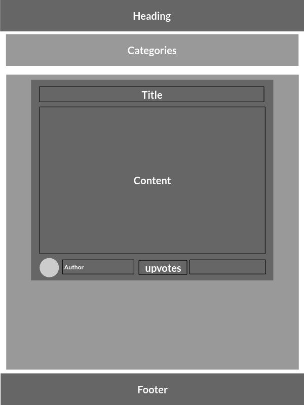

# Roadmap
* [Back to README](README.md)

## Wireframe

## Design
The application will use flat material design. The requirements of material design are as follows:
- Content should be centered.
- Containers should have rounded edges, and must contrast with the background color.
- There should be a single primary color and use of color blindness-friendly shades to note sectioned off content.
- There should be an accent color for noting clickable content such as buttons, menus, links and other interactive content.
- All content should be padded so that elements maintain a consistent shape when placed next to each other.
- Mobile First Design: Elements should be able to easily conform to a mobile user's screen which is often viewed in portrait mode where there is more height than width available.
- Responsive Design: The page must be responsive and adapt to all possible screen sizes.

## Requirements
The following requirements will be strictly necessary to provide a complete application according to the specifications of the project.

## Aria
- Screen Reader navigation. At the very top of the page there should be a hidden button for screenreaders or keyboard users to use to skip the heading content.
- Roles & Labels. The page should make use of roles and labels to ease screenreader navigation.

### Compatibility
The application must be compatible for all devices and shouldn't use browser specific features such as Mock Service Worker(MSW) for Chrome or any other feature not available to other browsers. CSS documents written must be compatible with Safari and Webkit.

### Deployability 
The application should be able to be deployed to a remote source and shouldn't store access keys in JSON files or other runtime-created files and should instead use environment variables to assign these keys according to web hosting standards.

### Rate Limited
The application should be rate limited and kept to a maximum of 10 requests per minute. For future proofing purposes the goal should be under 5 requests per minute allowed by the application. This rate limiting should be hidden well by user clickable elements and things such as caching techniques should be used.

### Performance
The application should perform at a decent pace and excessive JavaScript operations per user interaction should be limited. Opt to load content the user is likely to visit first and then load content as the user visits it.

## Pitch
Animal Lovers' Reddit! The client will feature content from subreddits such as r/aww or r/dogs or r/cats and should feature at least 5 different animal-related subreddits. However, other content will still be searchable, making it both convenient and usable. A clever name for this Reddit client would be "Pettit".

## Features

### Familiar Post Organization
The posts should be organized almost exactly as Reddit itself organizes posts when viewing from the web. This means arranged in the center of the screen in their own individual squares that contains user-interactible content such as a preview, a link to the post itself, the author, and upvotes.

### Animal Categories
There should be the ability to navigate to different Animal subreddits from the main page in a quick and user-friendly fashion.

### Easy Error Reporting
You should be able to get a link to the GitHub issues page that uses an error reporting template to make it easy for the user to report bugs that occur.

